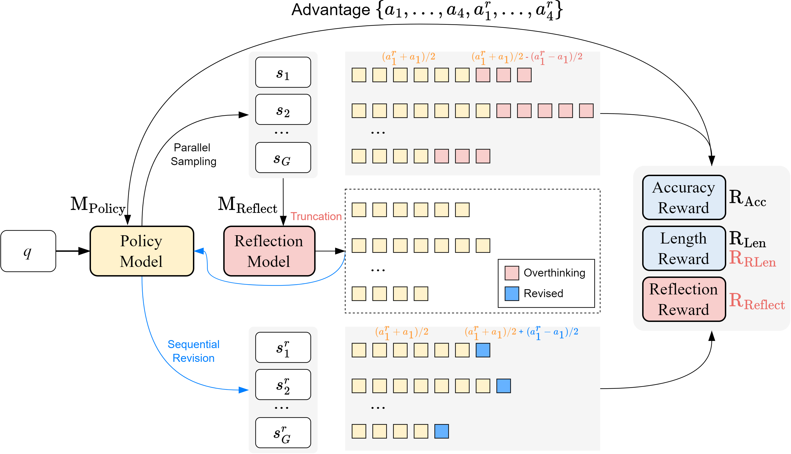

# REA-RL: Reflection-Aware Online RL for Efficient LRMs

*Official PyTorch implementation for the REA-RL paper. This repository provides the code to reproduce our findings and build upon our work in making Large Reasoning Models more efficient.*

**Table of Contents**
1.  [Overview](#overview)
2.  [Installation](#installation)
3.  [Repository Structure](#repository-structure)
4.  [Training Models](#training-models)
    * [Supervised Fine-Tuning (SFT) for Reflection Model](#supervised-fine-tuning-sft-for-reflection-model)
    * [Reflection-Aware Reinforcement Learning (REA-RL)](#reflection-aware-reinforcement-learning-rea-rl)
5.  [Evaluating Models](#evaluating-models)


## Overview

This repository hosts the code for **"REA-RL: Reflection-Aware Online Reinforcement Learning for Efficient Large Reasoning Models."** Our work addresses the "overthinking" problem in Large Reasoning Models (LRMs), where models expend excessive computational resources for minimal performance gain. REA-RL is built upon a few key ideas to tackle LRM overthinking:

1.  **Efficient Overthinking Detection:** We propose a method to identify points in a model's reasoning trace where it has likely found the answer but continues to reflect unnecessarily. This can be done by a larger model or a smaller, trained **Reflection Model**.
2.  **Online Sequential Revision with a Reflection Model:** A smaller, fine-tuned model (the "Reflection Model") is used during online RL. It revises sampled responses by truncating overthinking parts, providing more efficient examples for the LRM to learn from. This adds a sequential revision step to the parallel sampling common in RL.
3.  **Reflection-Aware Reward:** To prevent the LRM from becoming non-reflective (which can happen when solely optimizing for length), we introduce a "Reflection Reward" that encourages maintaining reflective capabilities on problems that need it.
4.  **Combined Efficiency and Performance:** The goal is to significantly reduce inference tokens (cost) while maintaining or even improving task accuracy, especially on complex reasoning tasks.

<p align="center">
  
</p>

## Installation

To run the code in this project, begin by creating a Python virtual environment (Python 3.11 is recommended).

```shell
conda create -n rea_rl python==3.11
conda activate rea_rl
pip install --upgrade pip
```

Next, install the project and its core dependencies:

```shell
# Clone the repository (if you haven't already)
# git clone [URL_OF_YOUR_REPO]
# cd REA-RL
pip install vllm==0.7.2
pip install setuptools
pip install -e .
pip install flash-attn==2.7.4.post1 --no-build-isolation
```

Finally, install the math verifier from rStar:

```shell
git clone https://github.com/MARIO-Math-Reasoning/MARIO_EVAL.git
cd MARIO_EVAL
cd latex2sympy && pip install . && cd ..
pip install -e .
cd ..
```


## Repository Structure

This repository builds upon the foundation of [OPEN-R1 repository](https://github.com/huggingface/open-r1). The main components are organized as follows:

  * **`src/generation/`**: This directory contains scripts and utilities for data processing, response generation, and evaluation:
      * `generate.py`: The primary entry point for generating model responses.
      * `labeling_distill_utils.py`: Core utilities for the overthinking detection mechanism and data preparation for the 32B LLM used in data distillation, which subsequently trains our reflection model.
      * `labeling_to_prefix.py`: Core utilities for the overthinking detection mechanism utilizing our reflection model. It is used to generate reflection results of varying intensities and to address truncation issues.
      * `sft_data.py`: Scripts for preparing Supervised Fine-Tuning (SFT) and Relative Preference Optimization (RPO) data for the baseline models.
      * `math_verify/`: Tools for verifying mathematical reasoning outputs, largely adapted from the [rStar repository](https://github.com/microsoft/rStar).
  * **`src/rea_rl/`**: This directory houses the core logic for REA-RL:
      * `grpo.py` & `rea_rl_trainer.py`: Implementation of Grouped Relative Policy Optimization, tailored for REA-RL.
      * `rewards.py`: Defines the reward functions for accuracy, length, and our novel reflection reward.
      * `sft.py`: Script for Supervised Fine-Tuning, employed for training the reflection model and the SFT baseline.
      * `dpo.py`: Script for Direct Preference Optimization, used for training the RPO baseline.
      * `vllm_server.py`: Adapted from `trl` version 0.16.0. A utility for setting up a VLLM server, potentially used for efficient online RL generation.
  * **`recipes/`**: This directory contains YAML configuration files for all experiments, covering various model setups (e.g., `DeepSeek-R1-Distill-Qwen-7B`), Reinforcement Learning (RL) methods (`config_ReflectRL.yaml`), and Accelerate configurations.
  * **`scripts/`**: Shell scripts for launching training, evaluation, and data processing tasks (e.g., `reflect_rl.sh`, `math_eval.sh`, `overthinking_detection.sh`).
  * **`dataset/`**: This directory is intended for storing datasets. We provide `DeepScaleR/DeepScaleR_clean.json`, which is a filtered dataset where the models failed to answer correctly across all four reasoning paths.


## Training Models

Training in REA-RL involves two primary stages: Supervised Fine-Tuning (SFT) of a Reflection Model and subsequent training of the main Large Reasoning Model (LRM) using our Reflection-Aware RL approach.

### Supervised Fine-Tuning (SFT) for Reflection Model

The Reflection Model, a smaller model, is trained to identify instances of overthinking in the LRM's generated outputs. In this step, we prepare the training data for the reflection model (this process also generates training data for the SFT and RPO baselines) and then train the model using this prepared data.

To train the reflection model:

```shell
# Preparing Data
bash scripts/reflection_model_train.sh
# Data Training
bash scripts/sft_train.sh Qwen2.5-7B-Instruct dataset/deepscaler_reflection_training.json model/Reflection_Model_Lora
```

After training, please merge the LoRA weights with the original model and save the merged model to the `model/Reflection_Model` directory. This facilitates efficient online inference using VLLM.

### Reflection-Aware Reinforcement Learning (REA-RL)

Once a base LRM and an optional (but highly recommended) trained Reflection Model are available, you can proceed with REA-RL. This method utilizes Grouped Relative Policy Optimization (GRPO) integrated with our reflection-aware components.

Our primary training script is configured to use three GPUs: two for training and one for VLLM-based data generation. To run our proposed approach, simply execute:

```shell
bash reflect_rl.sh
```

For alternative configurations, you can run other provided scripts or modify the respective configuration files located in the `recipes/` directory.

Ablation studies can be performed using the following scripts:

  * `scripts/reflect_rl_no_reflection_model.sh`
  * `scripts/reflect_rl_no_reflection_reward.sh`
  * `scripts/grpo_len.sh` (for GRPO with only length reward)
  * `scripts/grpo.sh` (for GRPO with only accuracy reward)

## Evaluating Models

Model evaluation, particularly for math reasoning tasks, is conducted using the `math_eval.sh` script. This script leverages the tools within `src/generation/math_verify/`.

```shell
# Example: Evaluate a trained model
bash scripts/math_eval.sh [GPU_ID] [MODEL_NAME] [STEP]
```
